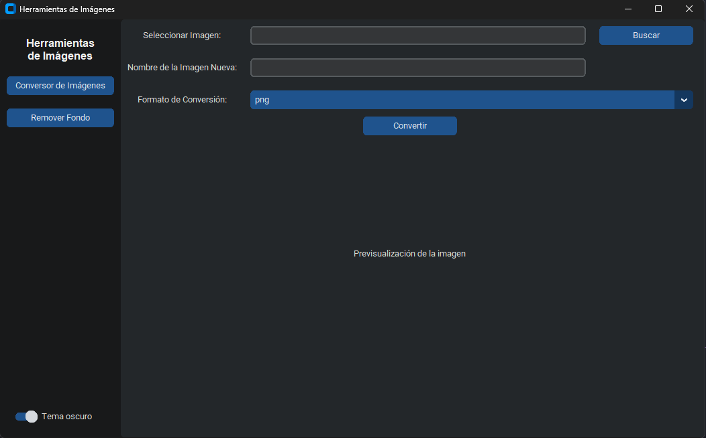
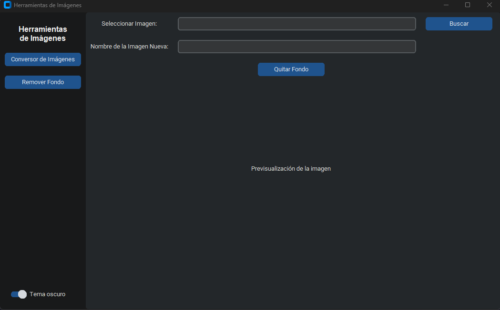

# Conversor de Imágenes

Conversor de imágenes con interfaz gráfica para Windows. Permite convertir y quitar fondo a imágenes de forma sencilla y rápida.

## Características

- Conversión de imágenes a varios formatos (PNG, JPG, WEBP, etc.)
- Remover fondo de imágenes automáticamente
- Selección múltiple de imágenes
- Guardado automático en carpetas organizadas por fecha

## Instalación

1. Clona el repositorio:
   ```sh
   git clone https://github.com/IFMLinares/Conversor-de-imagenes.git
   cd Conversor-de-imagenes
   ```

2. Crea y activa un entorno virtual:
   ```sh
   python -m venv env
   env\Scripts\activate
   ```

3. Instala las dependencias:
   ```sh
   pip install -r requirements.txt
   ```

4. Ejecuta la aplicación:
   ```sh
   python main.py
   ```

## Uso

1. Selecciona una o varias imágenes.
2. Elige el formato de salida.
3. Haz clic en "Convertir".
4. Las imágenes se guardarán en la carpeta `Images Converted/AAAA-MM-DD`.

## Capturas de pantalla

### Interfaz inicial: Conversion de imagenes


### Interfaz de remover fondo 


## Compilar a .exe

```sh
python -m PyInstaller main.spec
```
El ejecutable estará en la carpeta `dist/`.

## Configuración de `main.spec`

El archivo `main.spec` define cómo PyInstaller empaqueta la aplicación en un ejecutable (.exe). En este proyecto, la configuración personalizada asegura que todos los recursos y dependencias necesarias (especialmente para el funcionamiento de `rembg` y `onnxruntime`) se incluyan correctamente en el ejecutable.

### ¿Qué hace este archivo?

- **Incluye datos de rembg y onnxruntime:** Usa `collect_data_files` para recopilar archivos de datos y modelos requeridos por estas librerías, evitando errores de ejecución en otros equipos.
- **Configura la aplicación sin consola:** El parámetro `console=False` crea un ejecutable con solo interfaz gráfica, sin abrir una ventana de terminal.
- **Optimiza el ejecutable:** Usa UPX para comprimir el ejecutable y reducir su tamaño.
- **Define el punto de entrada:** Especifica que la aplicación inicia desde `main.py`.

### Fragmento relevante

```python
from PyInstaller.utils.hooks import collect_data_files

datas = collect_data_files('rembg') + collect_data_files('onnxruntime')
a = Analysis(
   ['main.py'],
   ...
   datas=datas,
   ...
)
...
exe = EXE(
   ...
   console=False,
   ...
)
```

### ¿Por qué es importante?

Sin esta configuración, el ejecutable podría fallar al no encontrar modelos o archivos internos de `rembg` y `onnxruntime`, especialmente en equipos donde no está instalado Python. El archivo `.spec` garantiza que todo lo necesario se incluya en la carpeta `dist/` generada por PyInstaller.

## Créditos

- [rembg](https://github.com/danielgatis/rembg)
- [CustomTkinter](https://github.com/TomSchimansky/CustomTkinter)

## Licencia

MIT
